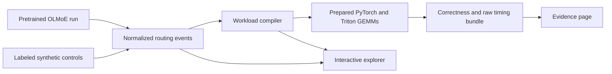

# MoEscope

**See how sparse routing becomes GPU work.**

MoEscope is an open-source systems lab that connects Mixture-of-Experts routing
to explicit matrix workloads and reproducible GPU measurements. We capture a
pretrained OLMoE router, compile its expert assignments, replay prepared grouped
GEMMs, and expose the artifacts in an interactive Astro website.

[Explore the lab](https://KingReaper6940.github.io/MoE-Scope/lab/) ·
[Inspect GPU evidence](https://KingReaper6940.github.io/MoE-Scope/results/) ·
[Read the ten-chapter journal](https://KingReaper6940.github.io/MoE-Scope/#writing) ·
[Reproduce the experiment](docs/reproduce.md)

## What we have built

- A dependency-free, versioned routing-trace schema with strict validation.
- Deterministic score routing and balanced, random, and skewed synthetic controls.
- A workload compiler for three-projection SwiGLU shapes, dispatch rows, tiles,
  padded arithmetic, and theoretical waves, with explicit assumptions.
- Token-major and expert-major CPU replay with randomized correctness checks.
- A real OLMoE capture adapter with independently observed expert input counts
  and learned-block output checks.
- A masked static persistent Triton grouped-GEMM kernel and PyTorch baseline.
- A CUDA-event/CUDA-graph benchmark harness that retains every raw sample.
- An interactive trace explorer, searchable evidence page, and technical journal.
- CI for local tests, browser/Python compiler parity, type checks, static builds,
  and internal-link verification.

## Measured release: NVIDIA A100-SXM4-40GB

Our September 12, 2026 local-date run produced the following artifacts.
Machine-readable timestamps use UTC and fall on September 13.

| Artifact | Evidence |
| --- | --- |
| Model capture | 480 routing events, 6 authored prompts, 16 layers, prefill + 4 decode steps |
| Model revision | `allenai/OLMoE-1B-7B-0924@6d84c48581ece794365f2b8e9cfb043c68ade9c5` |
| Adapter checks | Every expert histogram matches observed input counts; 6 learned-block output checks pass |
| GPU sweep | 54 synthetic + 36 captured-routing workloads |
| Backends | PyTorch loop + 3 fixed Triton configurations |
| Timing data | 10,800 samples; 30 per case/backend, 10 invocations per CUDA graph |
| Correctness | 360 case/backend checks + 36 irregular-group checks pass |
| GPU test suite | 84 tests passed on the A100 |
| Launch profile | PyTorch CPU/CUDA trace for a matched prepared workload |

The fastest tested Triton configuration beat the PyTorch loop in **43 of 90
cases** and lost in **47**. For the matched 128-token/top-2 synthetic controls:

| Routing | Active experts | PyTorch median | Best Triton median | PyTorch / Triton |
| --- | ---: | ---: | ---: | ---: |
| Balanced | 64 | 261.79 µs | 42.50 µs | 6.16× |
| Random | 63 | 325.86 µs | 54.88 µs | 5.94× |
| Concentrated | 2 | 10.30 µs | 12.13 µs | 0.85× |

These are **prepared single-projection grouped-GEMM measurements**, not full-model
inference speedups. The best configuration is chosen in-sample. Captured-routing
cases preserve real model histograms and dimensions but use seeded random
matrix values. Routing, gather/scatter, allocation, pointer preparation, and JIT
compilation are excluded. We retain losses and raw samples.

The experiment supports a bounded observation: routing geometry changes which
execution strategy works well. It does not establish a universal best kernel
or validate a learned selector.

## Try it locally

Python 3.11+; no third-party runtime dependencies for the CPU tools:

```bash
python -m venv .venv
# Activate .venv for your shell, then:
python -m pip install -e . pytest==8.4.2
python -m pytest
python -m moescope validate examples/traces/four-token-top2.json
python -m moescope summarize examples/traces/four-token-top2.json
python -m moescope generate --tokens 128 --experts 64 --top-k 2 --distribution balanced --output trace.json
python -m moescope compile trace.json --hidden-size 256 --intermediate-size 512 --num-sms 108 --output workload.json
python -m moescope benchmark examples/traces/four-token-top2.json --output cpu-result.json
```

The `moescope` console command is equivalent to `python -m moescope`.
Every command has `--help`; outputs are JSON. CPU replay is an educational
correctness path, not a high-performance inference implementation.

The website needs Node 22.13+:

```bash
python scripts/export_web.py
cd web
npm ci
npm test
npm run check
npm run build
npm run dev
```

From the repository root, run `python scripts/check_site.py` after building.
The static site targets GitHub Pages for `KingReaper6940/MoE-Scope`.
See [publishing and migration](docs/publish.md) for the one-time setup.

## Follow the artifacts



- [Capture manifest](examples/evidence/capture/manifest.json): model, prompts,
  dimensions, environment, event hashes, and adapter checks.
- [GPU results](examples/evidence/gpu/results.json): complete timing distributions,
  correctness tolerances, workload hashes, and configuration data.
- [Profile summary](examples/evidence/gpu/profile.txt) and
  [Chrome/Perfetto-compatible trace](examples/evidence/gpu/profile.json).
- [Source manifest](examples/evidence/source-manifest.json): hashes of the exact
  Python source, experiment scripts, and tests sent to the GPU.
- [Captured traces](examples/evidence/capture/) and
  [benchmark trace inputs](examples/evidence/gpu/traces/).
- [GPU requirements](experiments/gpu/requirements.txt) and
  [environment snapshot](examples/evidence/gpu/environment.txt).

The full reproduction and measurement protocol is in [docs/reproduce.md](docs/reproduce.md).
The original [Phase 1 guide](docs/phase-1.md) is retained as historical design context.

## The evidence contract

1. **Separate provenance.** Synthetic traces, model-captured routes, compiled
   estimates, CPU timings, and GPU measurements are labeled separately.
2. **Correctness before timing.** Validate traces, check dispatch, compare
   kernel outputs with an independent float32 PyTorch reference.
3. **Raw artifacts.** Preserve samples, hashes, seeds, software, hardware,
   configuration, tolerances, and timestamps.
4. **Scoped conclusions.** Report both wins and losses within the actual timing
   boundary. Do not turn a microbenchmark ratio into a model speedup.
5. **Honest history.** The first journal entry retains its July date. Eight
   retrospective chapters are arranged through September 10, show their actual
   September 12 publication date, and do not alter measurement or Git timestamps.

## Limits and next work

This release is an inspection and experimentation lab, not an inference server.
Our captured corpus is six authored prompts at batch one, not a representative
production workload. Shared experts are covered by synthetic/reference tests;
OLMoE has no shared experts in this capture.

We used one rented A100 in one measurement session without clock locking.
The profiler demonstrates launch structure but does not establish bandwidth,
tensor-core utilization, register-pressure, or occupancy bottlenecks. Those
require Nsight hardware-counter work. Useful follow-ups include repeated runs,
a held-out routing selector with measured overhead, a broader prompt corpus,
end-to-end dispatch timing, and cross-architecture validation.

The GPU pod used for the recorded experiment was terminated after artifact
verification. The site does not need a running GPU service.

## Prior art

We build on existing work and do not claim novelty by omitting it:

- [OLMoE](https://github.com/allenai/OLMoE): open model and routing analyses.
- [Triton Group GEMM](https://triton-lang.org/main/getting-started/tutorials/08-grouped-gemm.html):
  the static persistent scheduling design behind our inspectable baseline.
- [FlashInfer-Bench](https://github.com/flashinfer-ai/flashinfer-bench) and
  [FlashInfer Trace](https://huggingface.co/datasets/flashinfer-ai/flashinfer-trace):
  trace-driven kernel evaluation.
- [RaMP](https://arxiv.org/abs/2604.26039): routing-aware kernel selection,
  closely related to the motivation for our bounded configuration experiment.
- [ScatterMoE](https://github.com/shawntan/scattermoe): a compact Triton MoE implementation.

## License

[MIT](LICENSE).
